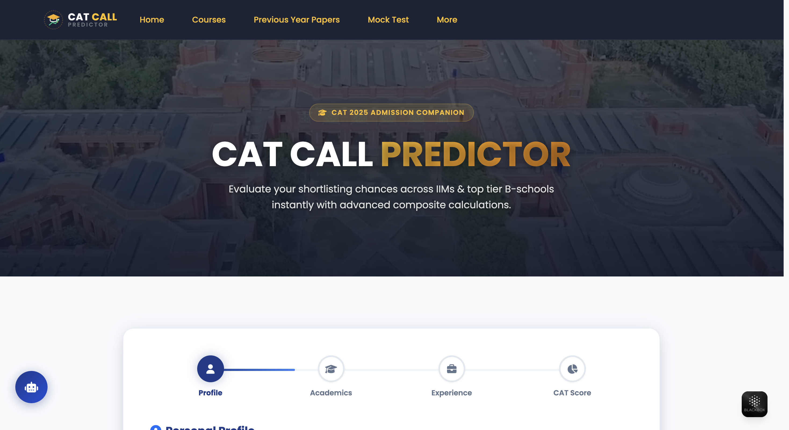
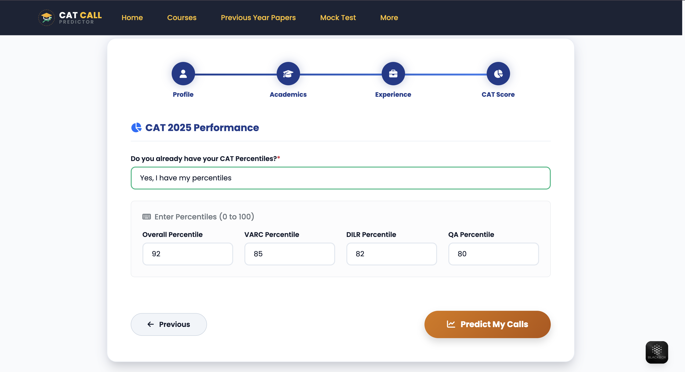
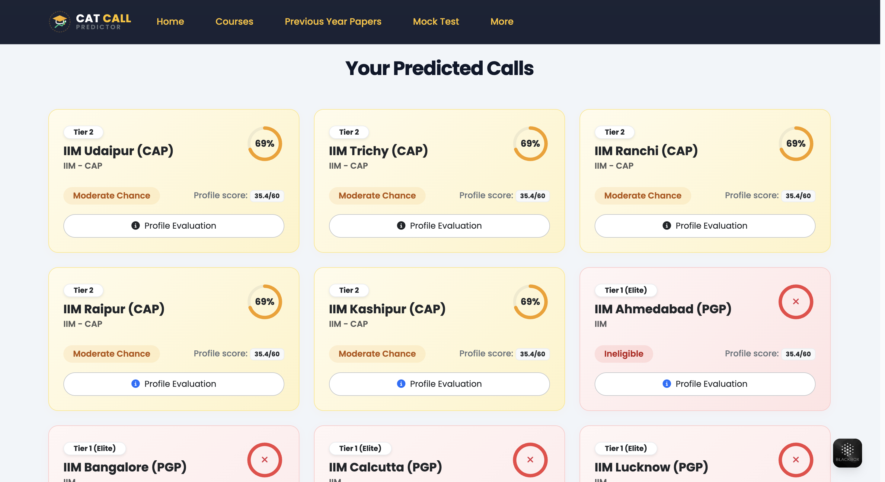
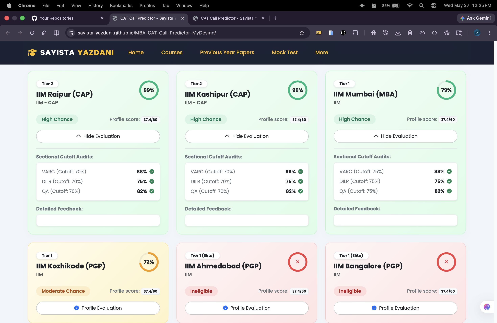
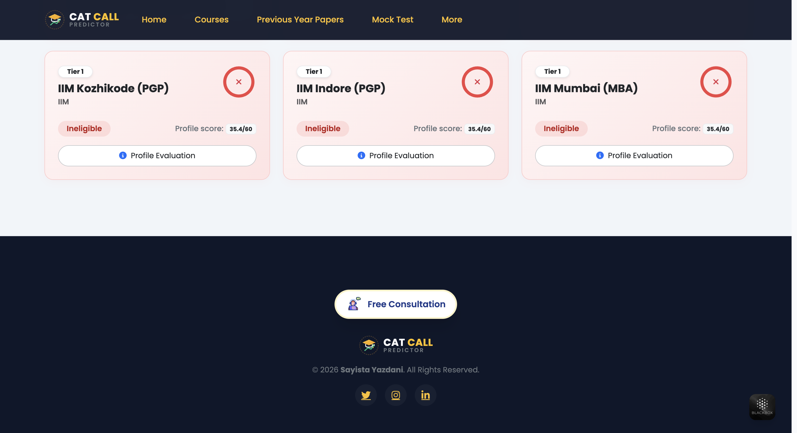
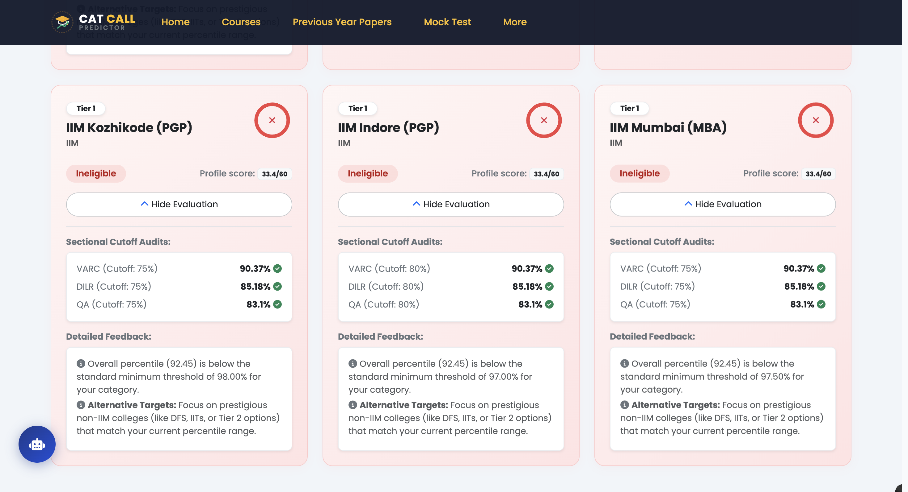
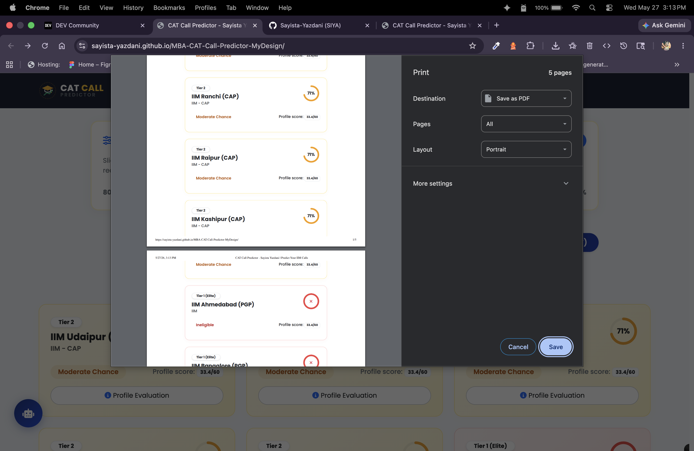

# CAT Call Predictor - React SaaS Web Application

A premium, highly interactive, and structurally accurate profile evaluation and call probability prediction tool designed for MBA aspirants. The application helps candidates determine their chances of receiving interview calls from elite IIMs (Indian Institutes of Management) and top B-schools (e.g., IIM Mumbai, VGSoM, DU DFS/DBE) by simulating realistic institutional composite score formulas.

---

## 📷 Interface Previews

### 1. High-Accuracy Results Dashboard (Light Colorful Cards)


### 2. Interactive Multi-Step Stepper Wizard






---

## 🌟 Key Features

### 1. Executive Editorial Aesthetics (Navy & Gold Theme)
- Designed with an academic executive visual palette featuring deep slate, royal navy, and warm gold/amber accents.
- Interactive dashboard outcome cards styled with dynamic, soft light-colorful pastel gradients (Emerald green for high chance, warm amber for moderate, sky blue for low, rose coral for ineligible).
- Unclipped, custom-rendered radial SVG progress gauges that clockwise animate Call Chance percentages smoothly without viewport crop issues.

### 2. Mobile-First Stepper Wizard (Framer Motion)
- Minimizes scrolling fatigue by organizing 25+ detailed profiling questions into a highly engaging, 4-step wizard using `framer-motion` for fluid, beautiful step-to-step slide transitions:
  - **Step 1: Personal Profile** (Name, Gender, Category, PwD Status)
  - **Step 2: Academic Profile** (10th/12th/UG Percentages, Board, Stream, XII Math score, Best-of-Four)
  - **Step 3: Experience & Extra Profile Details** (Work experience months across key target dates, relevance factor, profile strength, professional certifications like CA/CFA/CMA, PG, specialized degree matches)
  - **Step 4: CAT Scores** (Overall & Sectional Percentiles VARC, DILR, QA)
- Built with custom validation layers checking field compliance before step transitions.

---

## 🔥 Advanced SaaS Features (Newly Added!)

### 1. Interactive "What-If" Percentile Slider
- Dynamically recalculate all B-school call probabilities and outcome card gradients in real-time as you slide your CAT overall percentile.
- Sectional percentiles scale proportionally to maintain absolute mathematical and situational realism without requiring form resubmissions.

### 2. Premium PDF Profile Scorecard Download
- Generates a beautifully styled, high-contrast, single-page candidate scorecard print layout (`@media print`) that lets users export and share their evaluation results instantly as a PDF.

### 3. AI MBA Profile Counsellor (Conversational Chat Agent)
- A floating AI Mentor drawer widget running as a smart client-side **Expert System**.
- Automatically evaluates your profile score (out of 60) and predictions, answering specific questions about cutoffs, and suggesting target academic boosts.
- **WAT-PI Mock Interview Coach:** Offers profile-specific mock interview simulations, letting users submit textual answers to receive feedback and performance scores (out of 10).

### 4. Option A: LocalStorage Profile Data Persistence
- Saves all user inputs automatically in browser HTML5 `localStorage` in real-time.
- If a candidate refreshes the page or returns to the site later, their full academic profile and prediction cards are instantly reloaded!

### 5. Option B: 1-on-1 Profile Mentorship & Google Sheets CRM Integration
- Displays an elegant gold-gradient Mentorship Banner on the homepage and results panel.
- On-click, captures leads (Name, WhatsApp, Email, customized profile query) and logs them to a central Google Sheet Apps Script webhook.
- Seamlessly redirects the student to a pre-filled WhatsApp chat (`918873120581`) containing their complete generated profile report to secure high conversion rates.
- The floating **Free Consultation Drawer** is also fully synchronized to write leads directly into the same Google Sheet table!

### 6. Elite Hero Section Visual Upgrades
- Styled with prestigious, Poppins/Montserrat academic typography.
- Displays a golden border companion badge, dual-tone gold gradient headings, and a balanced executive descriptive subtitle.

---

## 🧪 Automated QA Test Suite (Vitest)

To ensure mathematical accuracy and prevent regression bugs, the codebase includes a robust automated unit and E2E test runner powered by **Vitest**:
- **Unit Tests:** Verify percentage-to-point translations against strict academic slabs and evaluate the work-experience bell-curve (including peak limits, smooth cap at 3 points, and automatic 5/5 relevance fallbacks).
- **Regression Tests:** Verify composite cushion differentials between GEM (male engineers) and high-diversity profiles.
- **E2E Flow Simulation:** Verifies strict sectional cutoff validations and disqualification flags.

Run the test suite on-demand:
```bash
npm run test
```

---

## 📂 Project Structure

```bash
MBA-CAT-Call-Predictor-MyDesign/
├── .github/
│   └── workflows/
│       └── deploy.yml          # GitHub Actions CI/CD YML Pipeline
├── public/
│   └── assets/                 # Background videos & Consultation GIFs
├── src/
│   ├── components/             # Atomic, Reusable UI Components
│   │   ├── Splash.tsx          # Fast Fade loading screen
│   │   ├── Header.tsx          # Navbar with SVG branding logo
│   │   ├── StepperForm.tsx     # 4-Step profile builder form wizard
│   │   ├── BSchoolCard.tsx     # B-School chance status results card
│   │   ├── WhatIfSlider.tsx    # Interactive What-If Percentile slider
│   │   ├── AICounsellor.tsx    # Conversational Chat Agent & Mock Coach
│   │   ├── Consultation.tsx    # Slide-up consultation drawer
│   │   └── Footer.tsx          # Footer with custom SVG logo
│   ├── data/
│   │   └── colleges.ts         # Strongly-typed database record list
│   ├── hooks/
│   │   └── usePredictor.ts     # Core math calculation engine hook
│   ├── styles/
│   │   ├── style.css           # Custom theme colors and circular progress rings
│   │   ├── mediaquary.css      # Screen size responsive grids & layouts
│   │   ├── animation.css       # Fluid step navigation keyframes
│   │   └── scroll.css          # Customized scrollbar properties
│   ├── types/
│   │   └── index.ts            # Strict TypeScript data model definitions
│   ├── App.tsx                 # Core orchestrator layout controller
│   └── main.tsx                # Bootstrap application entry point
├── index.html                  # Main mounting template page
├── package.json                # Modern build scripts & npm dependencies
├── tsconfig.json               # TypeScript compiler rules
└── vite.config.ts              # Vite compilation Base URL setup
```

---

## ⚡ Local Development Commands

### Prerequisites
Make sure you have [Node.js](https://nodejs.org) installed on your system.

### Install Dependencies
```bash
npm install
```

### Start Development Server
Launches a lightning-fast local edge server with Hot Module Replacement (HMR) that auto-refreshes your browser instantly as you save changes:
```bash
npm run dev
```

### Compile Production Bundle
Builds highly optimized, minified static HTML, CSS, and JS files inside the `dist/` directory, ready to serve anywhere:
```bash
npm run build
```

---

## 🤖 Continuous Deployment (CI/CD)

The project incorporates **GitHub Actions** for automated continuous deployment. 

Every time you push a commit to the `main` branch, the YML workflow automatically:
1. Spins up a secure cloud Ubuntu runner.
2. Installs package dependencies.
3. Compiles the optimized production bundle (`npm run build`).
4. Pushes the static build directly to the `gh-pages` branch, updating your live URL (`sayista-yazdani.github.io/MBA-CAT-Call-Predictor-MyDesign/`) automatically within 30 seconds!
